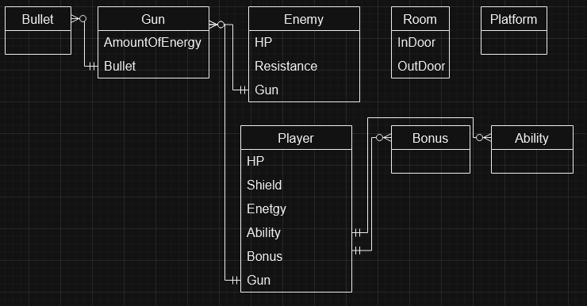
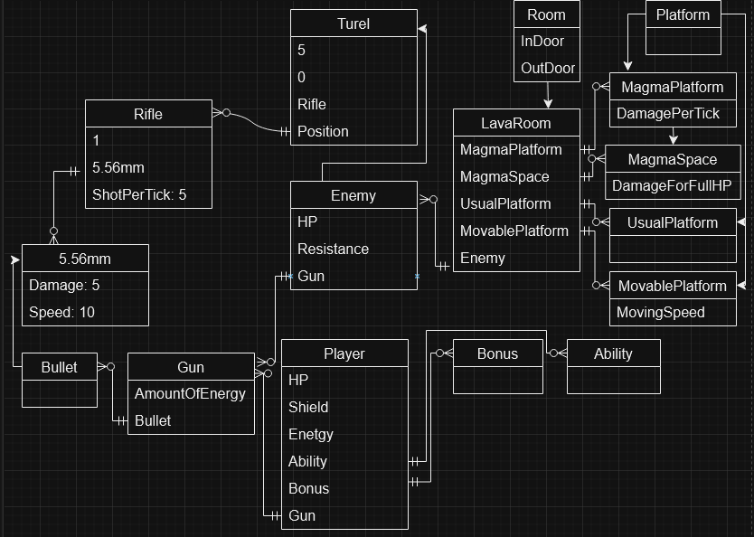

# Вторая часть концепта

## Абстрактные сущности

На данном концепте представлены базовые сущности, которые будут существовать в игре (в дальнейшем картина может поменяться).

### Player

Это сущность отвесающая за главного персонажа и как поля у него есть счётчик здоровья HP, счётчик защиты Shield, счётчик энергии Energy, сущность абстрактной способноти Ability, множество абстрактных бонусов Bonus, сущность абстрактного оружия Gun.

- HP - счётчик здоровья главного персонажа, не восстанавливается сам по себе, восстанавливается только при использовании соответсвующих предметов
- Shield - счётчик защиты, при получении урона игроком в начале теряются единицы из защиты и при нулевой защите теряется здоровье. Защита может сама восстанавливаться только когда главный герой не получает урона в течении некоторого времени.
- Energy - счётчик энергии, для стрельбы затрачивается то или иное количесво энергии. Сама по себе шкала не может восстанавливаться, при убийстве врагов можно получить энергию или использовав соответсвующие предметы.
- Ability - способность для главного героя, которая может делать разные вещи.
- Bonus - бонус, сущность которая даётся по мере прохождении комнат для улучшения некого билда или для разнообразия гейплея
- Gun - сущность отвечающая за оружие. Главный герой по мере прохождения может собрать до 9 оружий и переключаться между ними спомощью цифр на клавиатуре, при нажатии 0 игрок будет без оружия на руках. У главного героя как стартовое оружие будет двуствольный обрез.

### Ability

Это сущность отвечающая за способность с которой зашёл на прохождение главный герой. От этой сущности будут наследоваться все остальные способности. У данной сущности нет полей так как каждая способность может иметь свои уникальные фишки и общих черт между всеми может и не быть. 

### Bonus

Это сущность отвечающая за бонусы которые будет получать главный герой по мере прохождения комнат. От этой сущности будут наследоваться все остальные бонусы. У данной сущности нет полей так как каждый бонус может иметь свои уникальные фишки и общих черт между всеми может и не быть. Возможно получение каких-то определённых бонусов можно будеть получать ачивочки, и если получить все виды бонусов можно будет получить отдельную ачивочку, но это на будущее идея.

### Gun

Это сущность будет отвечать за абстрактное предстваление оржия в игре. Все остальные оружия будут наследоваться от этой сущности. (Только для ближнего оружия сделать так, чтобы при ударе опонента и при этом носитель оружия находится в движении и перед ударом он отпустил кнопку движения то он наносить урон с учётом скорости с которой он двигался к врагу, а-ля передаётся импульс движения в удар)

- AmountOfEnergy - какая-то определённая константа, которая будет говорить сколько энергии надо отнять от владельца оружия энергии для совершения выстрела
- Bullet - абстрактная сущность для пули

### Bullet

Это сущность будет отвечать за абстрактное предстваление пули для оружия. От этой сущности будут наследоваться все остальные пули. У данной сущности нет полей так как каждая пуля может иметь свои уникальные фишки и общих черт между всеми может и не быть. К пример для оружий ближнего боя пуля отвечает за дистанцию на которой урон будет действовать. 

### Enemy 

Это сущность отвечающая за абстрактное представление всех врагов. От этой сущности будут наследоваться все остальные враги.

- HP - счётчик здоровья соответсвующего врага
- Resistance - это константа с которой есть устойчивость к урону, если она равна 0, то сущность получает полный урон, если 1 то получает damage-1 и тд
- Gun - сущность отвечающая за оружие. Так как оружие требует затраты энергии на выстрел, то просто сделаем так, что у врагов энергии неисчеслимое количество

### Room

Это сущность отвечающая за абстрактное представление всех комнат. От этой сущности будут наследоваться все остальные комнаты. Все остальные уникальные фишки будут определяться отдельно для каждой комнаты.

- InDoor - это координаты места входа в комнаты (мб не нужна будет тк главный герой всё равно не может возвращаться назад)
- OutDoor - это дверь выхода, для начала сделаю просто как отметину на полу для, после дороботаю

### Platform

Сущность для предстваления платвормы

## Прототипный концепт

Для прототипа возьму только одну комнату, один тип врагов, один типо оружия, пока без способностей и бонусов.

