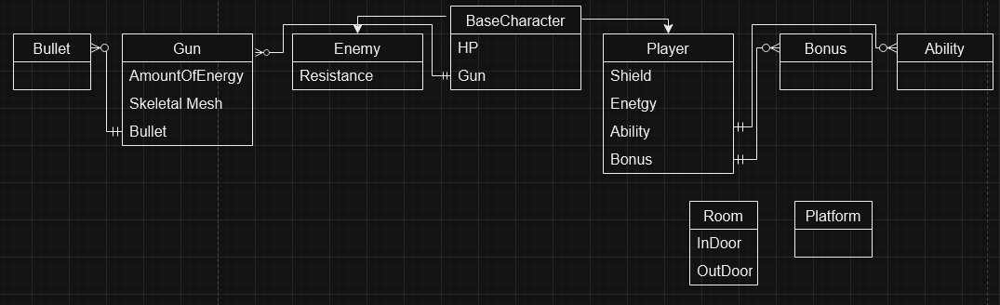
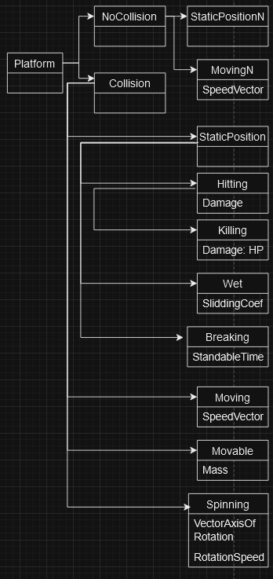
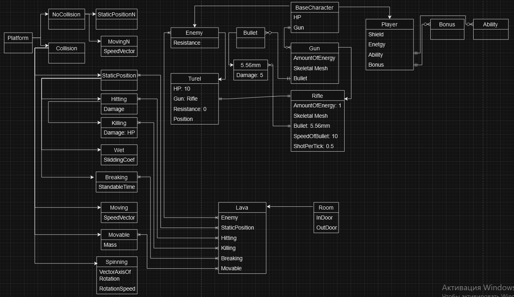

# Вторая часть концепта(переделанная)

## Абстрактные сущности

### BaseCharacter

Сущность от которой будут наследоваться все существа этой игры, главный наследний это сам игрок Player и абстрактный класс врагов Enemy. Поля класса:

- HP - счётчик здоровья существа, не восстанавливается сам по себе, восстанавливается только при использовании соответсвующих предметов или навыков. Также в пару к счётчику зводровья идёт число maxHP это число максимального здоровья.
- Gun - сущность отвечающая за оружие. Главный герой по мере прохождения может собрать до 9 оружий и переключаться между ними спомощью цифр на клавиатуре, при нажатии 0 игрок будет без оружия на руках. У главного героя как стартовое оружие будет двуствольный обрез. Для случая врагов у них нет возможности менять оружие, если конечно это не указано отдельно. 

### Player

Это сущность отвесающая за главного персонажа и как поля у него есть счётчик здоровья HP, счётчик защиты Shield, счётчик энергии Energy, сущность абстрактной способноти Ability, множество абстрактных бонусов Bonus, сущность абстрактного оружия Gun.

- Shield - счётчик защиты, при получении урона игроком в начале теряются единицы из защиты и при нулевой защите теряется здоровье. Защита может сама восстанавливаться только когда главный герой не получает урона в течении некоторого времени.
- Energy - счётчик энергии, для стрельбы затрачивается то или иное количесво энергии. Сама по себе шкала не может восстанавливаться, при убийстве врагов можно получить энергию или использовав соответсвующие предметы.
- Ability - способность для главного героя, которая может делать разные вещи.
- Bonus - бонус, сущность которая даётся по мере прохождении комнат для улучшения некого билда или для разнообразия гейплея.

### Ability

Это сущность отвечающая за способность с которой зашёл на прохождение главный герой. От этой сущности будут наследоваться все остальные способности. У данной сущности нет полей так как каждая способность может иметь свои уникальные фишки и общих черт между всеми может и не быть. 

### Bonus

Это сущность отвечающая за бонусы которые будет получать главный герой по мере прохождения комнат. От этой сущности будут наследоваться все остальные бонусы. У данной сущности нет полей так как каждый бонус может иметь свои уникальные фишки и общих черт между всеми может и не быть. Возможно получение каких-то определённых бонусов можно будеть получать ачивочки, и если получить все виды бонусов можно будет получить отдельную ачивочку, но это на будущее идея.

### Gun

Это сущность будет отвечать за абстрактное предстваление оржия в игре. Все остальные оружия будут наследоваться от этой сущности. (Только для ближнего оружия сделать так, чтобы при ударе опонента и при этом носитель оружия находится в движении и перед ударом он отпустил кнопку движения то он наносить урон с учётом скорости с которой он двигался к врагу, а-ля передаётся импульс движения в удар) Наверное сделаю так чтобы была проверка если сущность которая совершила выстрел это наследник класса враг, то не скпить момент отнятия энергии.

- AmountOfEnergy - какая-то определённая константа, которая будет говорить сколько энергии надо отнять от владельца оружия энергии для совершения выстрела
- Bullet - абстрактная сущность для пули
- Skeletal Mesh - это структура скелета оружия 

### Bullet

Это сущность будет отвечать за абстрактное предстваление пули для оружия. От этой сущности будут наследоваться все остальные пули. У данной сущности нет полей так как каждая пуля может иметь свои уникальные фишки и общих черт между всеми может и не быть. К пример для оружий ближнего боя пуля отвечает за дистанцию на которой урон будет действовать. К слову про мэш у каждого вида пули будет свой вид мэша может быть вообще статчной или иметь свой скелет.

### Enemy 

Это сущность отвечающая за абстрактное представление всех врагов. От этой сущности будут наследоваться все остальные враги.

- Resistance - это константа с которой есть устойчивость к урону, если она равна 0, то сущность получает полный урон, если 1 то получает damage-1 и тд

### Room

Это сущность отвечающая за абстрактное представление всех комнат. От этой сущности будут наследоваться все остальные комнаты. Все остальные уникальные фишки будут определяться отдельно для каждой комнаты.

- InDoor - это координаты места входа в комнаты (мб не нужна будет тк главный герой всё равно не может возвращаться назад)
- OutDoor - это дверь выхода, для начала сделаю просто как отметину на полу для, после дороботаю

### Platform

Сущность для предстваления платвормы. Нельзя будет ставить экземпляр этого класса тк, сама по себе она ничего не представляет. 

Есть базовые наследники:
- NoCollision - у его наследников будет отсутсвовать коллизия и иные объекты могут проходить сквозь них
  - StaticPositionN - это платформа, зафиксированная в пространстве
  - MovingN - эта платформа, которая может перемещаться в пространстве со скоростью SpeedVector

- Collision - у его наследников будет присутсвовать коллизия и иные объекты могут сталкиваться с этими платформами и не проходить через него.
  - StaticPosition - это платформа, зафиксированная в пространстве 
    - Hitting - платформа может наносить урон, равный полю Damage
      - Killing - у данная платформа просто домножит здоровье сущности, которая, ненароком, каснулась её, на ноль.
    - Wet - на этой платформе сущности могут скользить с каким-то коэфициентом скольжения SliddingCoef
    - Breaking - эта платформа разрушится через время StandableTime после касания её.
  - Moving - эта платформа может перемещаться в пространстве с вектор скоростью SpeedVector
  - Movable - эту платформу могут перемежать сущности передавая её свой импульс. У данной платформы есть масса Mass. Пример: какие-нибудь коробки для выстраивания платформы.
  - Spinnig - эта платформа вращается вдоль вектор оси VectorAxisOfRotation, с определённой угловой скоростью RotationSpeed.

## Prototype
 

### 5.56mm 
Наследник класса Bullet, наносимый урон Damage: 5

### Rifle
Наследник класса Gun, поля:
- AmountOfEnergy = 1
- Skeletal Mesh - будет какой-то свой определённый скелетал мэш
- Bullet: 5.56mm
- SpeedOfBullet = 10
- ShotPerTick = 0.5

### Turel
Наследник абстрактного класса Enemy, поля:
- HP: 10
- Gun: Rifle
- Resistance = 0
- Position - где-то точно будет заспавнен

### Lava
Наследниек абстрактного класса Room, (и где-то должны быть вход и выход) поля:
- Enemy - тип врагов, которые встретятся в такой комнате (если это Enemy, то могут быть любые враги)
- StaticPosition - тип платформ, которые встретятся в такой комнате
- Hitting - тип платформ, которые встретятся в такой комнате
- Killing - тип платформ, которые встретятся в такой комнате
- Breaking - тип платформ, которые встретятся в такой комнате
- Movable - тип платформ, которые встретятся в такой комнате