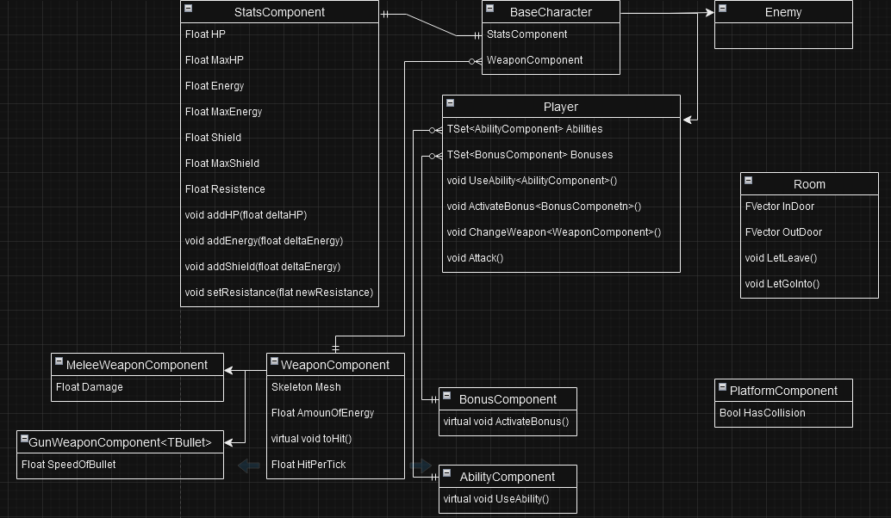

# Вторая часть концепта(переделанная (ещё раз))

## StatsComponent
(Компонента которая в себе объединяет "статы" существ в данной игре и взаимодествие с этими "статами")
### Поля
- HP - уровень здоровья, не восставнавливается сомостоятельно, если конечно не обговорены частные случаи
- Energy - уровень энергии, необходимо для совершения выстрела, не восстанавливается сомостоятельно, если конечно не обговорены частные случаи. В случае главного героя, после убийства врагов есть шанс увеличения энергии.
- Shield - уровень щита, при получении урона в начале теряет единицы щит и если щит уже пал, то теряется здоровье. Если персонаж не получает урона, то его щит начаинает восстанавливаться.
- Resistance - это константа с которой есть устойчивость к урону, если она равна 0, то сущность получает полный урон, если 1 то получает damage-1 и тд.

### Методы
- addHP/Energy/Shield(float delta) - если дельта положительна то персонаж хилится, инче теряет едииницы по соответсвующей шкале
- setResistance(float) - поставить новый уровень устойчивости

## WeaponComponent
(Компонента отвечающая за оружия и взаимодействия с ними)

### Поля
- Skeletal Mesh - это структура скелета оружия 
- AmountOfEnergy - какая-то определённая константа, которая будет говорить сколько энергии надо отнять от владельца оружия энергии для совершения выстрела
- HitPerTick - это частота удара или выстрала с помощью оружия

### Методы
- ToHit() - совершить выстрел, будет смотреть если величина (AmountOfEnergy * IsPlayer()(вернёт true если носитель это главный герой)) <= Enengy(поле у носителя), то совершит выстрел  

## MeleeWeaponComponent
(От этого компонета будут наследоваться все остальные оружия ближнего боя)
(сделать так, чтобы при ударе опонента и при этом носитель оружия находится в движении и перед ударом он отпустил кнопку движения то он наносить урон с учётом скорости с которой он двигался к врагу, а-ля передаётся импульс движения в удар)

### Поля
- Damage - урон наносимый за один удар

## GunWeaponComponent
(От этого компонета будут наследоваться все остальные оружия дистанционного боя)

### Поля
- SpeedOFBullet - скорость полёта пули

## AbilityComponent
(Это сущность отвечающая за способность с которой зашёл на прохождение главный герой. От этой сущности будут наследоваться все остальные способности. У данной сущности нет полей так как каждая способность может иметь свои уникальные фишки и общих черт между всеми может и не быть.)

### Методы
- UseAbility() - виртуальная функция для активации способности

## BonusComponent
(Это сущность отвечающая за бонусы которые будет получать главный герой по мере прохождения комнат. От этой сущности будут наследоваться все остальные бонусы. У данной сущности нет полей так как каждый бонус может иметь свои уникальные фишки и общих черт между всеми может и не быть. Возможно получение каких-то определённых бонусов можно будеть получать ачивочки, и если получить все виды бонусов можно будет получить отдельную ачивочку, но это на будущее идея.)

### Методы
- ActivateBonus() - виртуальная функция для использования бонуса 

## BaseCharacter
(Класс описыващий характер всех существ в данной игре)

### Поля
- StatsComponent
- WeaponComponent

## Enemy
(Это сущность отвечающая за абстрактное представление всех врагов. От этой сущности будут наследоваться все остальные враги.)

## Player
(Это сущность отвесающая за главного персонажа, наследник класса BaseCharacter)

### Поля
- Abilities - множество способностей у персонажа
- Bonuses - множество бонусов у персонажа

### Методы 
- UseAbility - функция которая вызовет аналогичный метод у конкретной способности
- ActivateBonus - функция которая вызовет аналогичный метод у конкретного бонуса
- ChangeWeapon - поменять оружие которое стоит на руках 
- Attack - функция для совершения выстрела с помощью оружия

## Room
(Это сущность отвечающая за абстрактное представление всех комнат. От этой сущности будут наследоваться все остальные комнаты. Все остальные уникальные фишки будут определяться отдельно для каждой комнаты.)

### Поля
- InDoor - это координаты места входа в комнаты (мб не нужна будет тк главный герой всё равно не может возвращаться назад)
- OutDoor - это дверь выхода, для начала сделаю просто как отметину на полу для, после дороботаю

### Методы
- LetLeave - функция, чтобы выпустить главного героя из комнаты, только если главный герой выполнил все необходимые условия для этого
- LetGoInto - функция, чтобы впустить главного героя в комнату

## Platform
(Сущность для предстваления платвормы. Нельзя будет ставить экземпляр этого класса тк, сама по себе она ничего не представляет.)

### Поля
- hasCollision - логическая переменная отвечающая за присутствие колизии у текущей платформы

